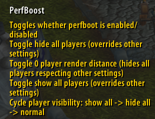

# Installation
- Add the dll from the lastest https://gitea.com/avitasia/perf_boost/releases next to WoW.exe
- Enable perf_boost.dll in the launcher if you use it or add perf_boost.dll to dlls.txt


- Install https://gitea.com/avitasia/PerfBoostSettings like any other addon

# General
- Any distance set to -1 just means it is disabled and that category won't ever be hidden.
- Setting a distance to 0 will always hide that category
- If you want different settings on different characters enable `Per character settings` otherwise settings will be shared with all your characters
- Play around with the settings to best fit your role (tanks and healers likely don't want to hide as much stuff as ranged dps)
- If you don't want to hide players just turning off their spell effects will still be a large performance boost
- Check out the readme for more detailed information on settings and commands https://gitea.com/avitasia/PerfBoostSettings/

# 1.  Setup keybinds or a macro to turn off perf boost quickly when needed
If you go to Esc -> Keybinds and scroll down you should see a section for PerfBoostSettings with these options:



The 2 most common ways to use the keybinds:

- Have all/most players shown by default and temporarily hide everyone using "Toggle 0 player render distance" when you need the extra fps or want to be able to see better
- Have all/most players hidden by default using a low player render distance and temporarily show everyone using "Toggle show all players" for fights that require it.

Or can macro these commands if you prefer
```
- `/pbenable` or `/perfboostenable` - Toggle performance boost on/off.  Can be keybound also.
- `/pbshowallplayers` or `/pbsap` - Toggle show all players on/off.  Can be keybound also.
- `/pbhideallplayers` or `/pbhap` - Toggle hide all players on/off.  Can be keybound also.
- `/pbcycleplayervisibility` or `/pbcycle` - Cycle through player visibility modes: normal → show all → hide all → repeat.  Can be keybound also.
- `/pbtoggleplayerrenderist` or `/pbtrd` - Toggle player render distance between 0 and previous value.  Can be keybound also.
```

# 2.  Suggested rendering settings 
## Initial Recommended
- Default player render distance -1 (you'll see everyone out of combat)
- In combat player render distance - 10yd
- In combat trash distance 60yd
- Pet distance 0 yd
- Totem/Guardian distance 0 yd
- Corpse distance 0 yd
- In cities distance 5yd
- Doodad render distance 60yd

## Max Performance
- Set either Default or In combat (when most people suffer fps drops) player render distance to 0 yd
- Whitelist tanks you want to see (if any) by adding their names to Always Render Players
- In combat trash distance 60yd
- Pet distance 0 yd
- Totem/Guardian distance 0 yd
- Corpse distance 0 yd
- In cities distance 5yd
- Doodad render distance 15yd

## Player whitelist/blacklist commands
If you are using small player render distances you might find it useful to set tanks to always render.  
Alternatively, if you use a normal render player distance you find it useful to selectively hide like characters like taurens.

- `/pbalwaysrender` or `/pbar` - Add current target to always render list
- `/pbalwaysrenderremove` or `/pbarr` - Remove current target from always render list
- `/pbalwaysrenderclear` or `/pbarc` - Clear entire always render list
- `/pbneverrender` or `/pbnr` - Add current target to never render list  
- `/pbneverrenderremove` or `/pbnrr` - Remove current target from never render list
- `/pbneverrenderclear` or `/pbnrc` - Clear entire never render list

# 3.  Suggested spell visual settings 
## Initial Recommended
- Defaults are fine (will just hide spells cast by hidden players)

## Max Performance
- Spell visuals off
- Ground effects off
- Unit auras off
- Player auras off
  
- Whitelist specific spells by adding them to Always Shown Spell Ids

# 4.  Filter GUID Events
`Filters out generally unnecessary superwow GUID-based events to reduce event spam and improve performance. Blocks events like UNIT_AURA, UNIT_HEALTH, UNIT_MANA when triggered with a guid instead of a string like 'player' or 'raid1', while preserving commonly used guid events like UNIT_COMBAT and UNIT_MODEL_CHANGED.`

If you use superwow you most likely can turn this on to reduce event spam.  I think very few addons will be negatively affected by turning this on whereas many addons are affected by the repeat event spam.  If you notice something no longer happening in one of your addons just disable this setting.
